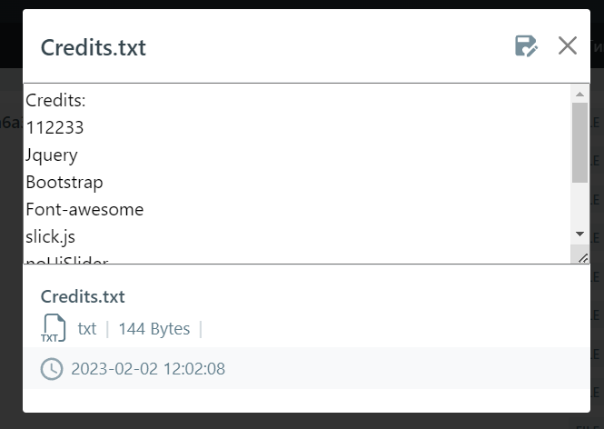

# Задание на 8 неделю

Сделать CRUD приложение для работы с яндекс диском по API, используя библиотеку https://github.com/jack-theripper/yandex  
1. Установить библиотеку через composer  
2. Получить API токен https://yandex.ru/dev/oauth/doc/dg/tasks/get-oauth-token-docpage/
    внести в .env файл YANDEX_DISK_API_TOKEN 
   
        y0_AgAAAAAbhyvzAAkM2QAAAADasPGlKbH7KzZSRYmYUXEUmAyy189Lu84
   
3. Изучить документацию https://yandex.ru/dev/disk/api/concepts/about-docpage/  
4. Реализовалть добавление, просмотр и удаление файлов на любой странице 

   

5. (Дополнительно) Реализовать изменение файлов 

